# Bug Reports & Debugging Guides

This directory contains bug reports, debugging strategies, and root cause analyses for known issues in the OBCMS system.

---

## Active Issues

### 🔴 HIGH PRIORITY

#### Calendar Event Deletion Bug
**Status:** Under Investigation
**Priority:** HIGH
**Last Updated:** 2025-10-06

**Issue:** Events are not removed from the calendar after deletion, despite the delete operation completing successfully in the database.

**Quick Start:**
1. Read: [Quick Start Guide](CALENDAR_DEBUG_QUICKSTART.md) (2 minutes)
2. Run: Debug script from [calendar_debug.js](calendar_debug.js)
3. Reference: [ID Mismatch Examples](ID_MISMATCH_EXAMPLES.md)

**Documentation Index:**

| Priority | Document | Purpose |
|----------|----------|---------|
| ⭐⭐⭐ | [Quick Start Guide](CALENDAR_DEBUG_QUICKSTART.md) | **Start here** - 2-minute debugging procedure |
| ⭐⭐⭐ | [calendar_debug.js](calendar_debug.js) | **Automated debugging script** - paste into console |
| ⭐⭐ | [Root Cause Analysis](CALENDAR_DELETE_ROOT_CAUSE_ANALYSIS.md) | Detailed analysis with evidence and likely fixes |
| ⭐⭐ | [ID Mismatch Examples](ID_MISMATCH_EXAMPLES.md) | Visual examples of common mismatch patterns |
| ⭐ | [Complete Debug Guide](CALENDAR_EVENT_DELETE_DEBUG.md) | Comprehensive debugging strategy |
| ⭐ | [Summary](CALENDAR_EVENT_DELETE_DEBUGGING_SUMMARY.md) | Overall summary and documentation index |

**Files Involved:**
- `src/templates/common/oobc_calendar.html` (delete handler)
- `src/common/views/work_items.py` (delete endpoint)
- `src/common/views/calendar.py` (calendar feed)

**Root Cause (Hypothesis):**
UUID format mismatch between calendar event IDs and delete event payload. Calendar likely stores `"work-item-{uuid}"` with specific case (uppercase or lowercase), but delete handler may be receiving UUID in different format.

**Recommended Action:**
1. Run `calendar_debug.js` on calendar page
2. Delete an event
3. Check console for diagnostic output
4. Apply fix based on mismatch type identified

---

## Debugging Workflow

### For Calendar Event Deletion Issue

```mermaid
graph TD
    A[Start] --> B[Open Calendar Page]
    B --> C[Open Browser Console F12]
    C --> D[Paste calendar_debug.js]
    D --> E[Delete an Event]
    E --> F{Event Removed?}
    F -->|Yes| G[Issue Resolved ✅]
    F -->|No| H[Check Console Output]
    H --> I[Identify Mismatch Type]
    I --> J{Mismatch Found?}
    J -->|Yes| K[Apply Fix from Examples]
    J -->|No| L[Review Root Cause Analysis]
    K --> M[Test Fix]
    L --> M
    M --> N{Fix Works?}
    N -->|Yes| O[Document & Commit]
    N -->|No| P[Try Alternative Fix]
    P --> M
```



---

## Common Mismatch Patterns

### Pattern 1: UUID Case Sensitivity
**Calendar:** `"work-item-123e4567-..."`
**Delete:** `"123E4567-..."`
**Fix:** Convert to lowercase/uppercase

### Pattern 2: Type Mismatch
**Calendar:** `"work-item-123"` (string)
**Delete:** `123` (number)
**Fix:** `String(id)` or `Number(id)`

### Pattern 3: Missing Prefix
**Calendar:** `"work-item-123"`
**Delete:** `"123"`
**Fix:** Add prefix `` `work-item-${id}` ``

### Pattern 4: Wrong Property Path
**Calendar:** N/A
**Delete:** `event.detail.id` is `undefined`
**Fix:** Use `event.detail.workItem.id`

**See:** [ID_MISMATCH_EXAMPLES.md](ID_MISMATCH_EXAMPLES.md) for complete examples with code

---

## Quick Reference Commands

### Diagnostic Commands (Browser Console)

```javascript
// List all calendar event IDs
calendar.getEvents().map(e => ({id: e.id, type: typeof e.id}))

// Listen for delete events
document.body.addEventListener('workItemDeleted', e => console.log('Delete:', e.detail))

// Manual event removal
calendarDebug.removeById('work-item-123')

// Force refresh
calendarDebug.refresh()
```

### Testing Commands

```javascript
// Count events before deletion
console.log('Before:', calendar.getEvents().length)

// After deletion (run in setTimeout)
setTimeout(() => console.log('After:', calendar.getEvents().length), 2000)

// Verify specific event exists
console.log('Exists?', calendar.getEventById('work-item-123') !== null)
```

---

## Fix Templates

### Backend Fix (Python)

```python
# File: src/common/views/work_items.py
return HttpResponse(
    status=200,
    headers={
        'HX-Trigger': json.dumps({
            'workItemDeleted': {
                'id': str(work_item_id),  # ← Ensure string
                'title': work_title,
                'type': work_type_display
            }
        })
    }
)
```

### Frontend Fix (JavaScript)

```javascript
// File: src/templates/common/oobc_calendar.html
document.body.addEventListener('workItemDeleted', function(event) {
    var workItemId = event.detail.id;

    // Try multiple formats
    var formats = [
        'work-item-' + workItemId,
        'work-item-' + String(workItemId).toLowerCase(),
        'work-item-' + String(workItemId).toUpperCase()
    ];

    var calendarEvent = null;
    for (var i = 0; i < formats.length; i++) {
        calendarEvent = calendar.getEventById(formats[i]);
        if (calendarEvent) {
            console.log('✅ Found with format:', formats[i]);
            break;
        }
    }

    if (calendarEvent) {
        calendarEvent.remove();
    } else {
        console.error('❌ Event not found. Refreshing calendar...');
        calendar.refetchEvents();
    }
});
```

---

## Verification Checklist

After applying a fix:

- [ ] Event disappears from calendar immediately
- [ ] No console errors during deletion
- [ ] Modal closes smoothly
- [ ] Page refresh confirms deletion persisted
- [ ] Multiple consecutive deletions work
- [ ] Works for all work types (project, activity, task)
- [ ] No console warnings

---

## Related Documentation

### OBCMS General
- [Main Documentation](../../docs/README.md)
- [Development Guide](../../docs/development/README.md)
- [Testing Guide](../../docs/testing/README.md)

### Calendar System
- [Calendar System Rebuild](../../CALENDAR_REBUILD_COMPLETE.md)
- [Work Items System](../../WORKITEM_MIGRATION_COMPLETE.md)

### Instant UI
- [Instant UI Improvements](../../docs/improvements/instant_ui_improvements_plan.md)

---

## Contributing

When reporting a new bug:

1. **Create a new markdown file** in this directory
2. **Use template:**
   ```markdown
   # [Bug Title]

   **Status:** Open/Under Investigation/Fixed
   **Priority:** LOW/MEDIUM/HIGH/CRITICAL
   **Date Reported:** YYYY-MM-DD
   **Last Updated:** YYYY-MM-DD

   ## Issue Description
   [Clear description of the problem]

   ## Steps to Reproduce
   1. Step 1
   2. Step 2
   3. Step 3

   ## Expected Behavior
   [What should happen]

   ## Actual Behavior
   [What actually happens]

   ## Environment
   - Browser: [e.g., Chrome 120]
   - OS: [e.g., macOS 14]
   - OBCMS Version: [commit hash]

   ## Evidence
   - Screenshots
   - Console logs
   - Network requests

   ## Diagnostic Results
   [Results from debugging]

   ## Proposed Fix
   [Suggested solution]

   ## Files Involved
   - `path/to/file1.py`
   - `path/to/file2.html`
   ```

3. **Update this README** with a link to your bug report
4. **Tag appropriately** with priority level
5. **Notify team** if priority is HIGH or CRITICAL

---

## Bug Resolution Workflow

```
1. Report Bug
   ↓
2. Triage (assign priority)
   ↓
3. Investigate (create debugging docs)
   ↓
4. Diagnose (identify root cause)
   ↓
5. Fix (apply solution)
   ↓
6. Test (verify fix works)
   ↓
7. Document (update bug report)
   ↓
8. Close (mark as fixed)
   ↓
9. Archive (move to resolved/ subdirectory)
```

---

## Status Legend

| Status | Meaning |
|--------|---------|
| 🔴 Open | Bug reported, not yet investigated |
| 🟡 Under Investigation | Debugging in progress |
| 🟢 Fix Available | Solution identified, not yet applied |
| ✅ Fixed | Fix applied and tested |
| 📦 Archived | Fixed and moved to archive |

| Priority | SLA |
|----------|-----|
| CRITICAL | Fix within 24 hours |
| HIGH | Fix within 1 week |
| MEDIUM | Fix within 1 month |
| LOW | Fix when convenient |

---

## Archive

When a bug is fixed:

1. Move file to `resolved/` subdirectory
2. Update status to "Fixed"
3. Add resolution date
4. Link to commit that fixed it
5. Update this README to remove from active issues

---

**Last Updated:** 2025-10-06
**Active Issues:** 1
**Resolved Issues:** 0
